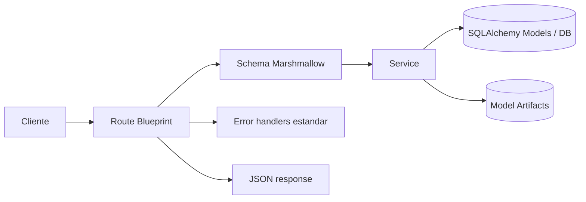

# CognIA Backend (`EndDark16/CognIA`)

Backend de CognIA para cuestionarios, inferencia y operacion API en salud mental infantil (6-11 anos), con enfoque de screening/apoyo profesional en entorno simulado.

Este README esta pensado como fuente principal de onboarding tecnico y operacion local. Toda afirmacion de comportamiento se deriva del estado real del repositorio (codigo, migraciones, scripts, tests y docs versionadas).

## Tabla de contenido
- [1. Titulo y resumen ejecutivo](#1-titulo-y-resumen-ejecutivo)
- [2. Proposito del proyecto](#2-proposito-del-proyecto)
- [3. Estado actual del backend](#3-estado-actual-del-backend)
- [4. Principios metodologicos y de producto](#4-principios-metodologicos-y-de-producto)
- [5. Arquitectura general](#5-arquitectura-general)
- [6. Mapa del repositorio](#6-mapa-del-repositorio)
- [7. Stack tecnologico](#7-stack-tecnologico)
- [8. Prerrequisitos](#8-prerrequisitos)
- [9. Quickstart real](#9-quickstart-real)
- [10. Configuracion por variables de entorno](#10-configuracion-por-variables-de-entorno)
- [11. Ejecucion local](#11-ejecucion-local)
- [12. Base de datos y migraciones](#12-base-de-datos-y-migraciones)
- [13. Bootstrap y carga de datos/artefactos operativos](#13-bootstrap-y-carga-de-datosartefactos-operativos)
- [14. API y gobierno de contratos](#14-api-y-gobierno-de-contratos)
- [15. Mapa de endpoints por dominio](#15-mapa-de-endpoints-por-dominio)
- [16. Flujos operativos principales](#16-flujos-operativos-principales)
- [17. Autenticacion, autorizacion y seguridad](#17-autenticacion-autorizacion-y-seguridad)
- [18. Modelos e inferencia](#18-modelos-e-inferencia)
- [19. Questionnaires: legacy, runtime v1 y v2](#19-questionnaires-legacy-runtime-v1-y-v2)
- [20. Problem reports](#20-problem-reports)
- [21. Reporting y dashboards](#21-reporting-y-dashboards)
- [22. Testing y calidad](#22-testing-y-calidad)
- [23. Analisis estatico / Sonar / calidad documental](#23-analisis-estatico--sonar--calidad-documental)
- [24. Trazabilidad, versionado y releases](#24-trazabilidad-versionado-y-releases)
- [25. Politica de artefactos](#25-politica-de-artefactos)
- [26. Convenciones de ramas, PRs y worktrees](#26-convenciones-de-ramas-prs-y-worktrees)
- [27. Guia rapida de troubleshooting](#27-guia-rapida-de-troubleshooting)
- [28. Limitaciones conocidas](#28-limitaciones-conocidas)
- [29. Mapa de documentacion interna](#29-mapa-de-documentacion-interna)
- [30. Comandos utiles para mantenedores](#30-comandos-utiles-para-mantenedores)

## 1. Titulo y resumen ejecutivo
### Que es CognIA backend
- API Flask con autenticacion, MFA, RBAC, cuestionarios (legacy/v1/v2), inferencia runtime, dashboards y reportes.
- Integra persistencia SQLAlchemy + Alembic y contrato OpenAPI unificado.

### Para que sirve
- Orquestar flujos de evaluacion y resultados por dominio (`adhd`, `conduct`, `elimination`, `anxiety`, `depression`) para soporte de screening.
- Exponer endpoints administrativos y operativos para backoffice, QA e integracion.

### Alcance funcional real
- Auth/JWT/MFA/password reset.
- Admin (usuarios, roles, evaluaciones, cuestionarios, email, metricas, impersonacion).
- Questionnaires legacy v1, questionnaire runtime v1 y cuestionario operacional v2.
- Problem reports con adjuntos y auditoria.
- Dashboards/report jobs v2.
- OpenAPI/Swagger, health/readiness/metrics.

### Disclaimer metodologico y etico
- CognIA en este repositorio es **screening/apoyo profesional en entorno simulado**.
- **No** es diagnostico clinico automatico ni definitivo.

## 2. Proposito del proyecto
- Problema: centralizar una plataforma backend auditable para captura de cuestionarios, inferencia y trazabilidad operativa.
- Tipo de sistema: backend API con componentes de seguridad, gobierno de contratos y runtime de modelos.
- Publico objetivo de este README:
  - mantenedores backend,
  - QA/arquitectura,
  - integradores API,
  - personas que retoman contexto tecnico-operativo.

## 3. Estado actual del backend
### Activo (linea operacional)
- `api/routes/questionnaire_v2.py` (`/api/v2/*`) para sesiones, historial, share, PDF, dashboards y report jobs.
- `docs/openapi.yaml` como contrato activo unico.
- Guardrails de contrato/documentacion OpenAPI en `tests/contracts/*`.
- Backend de `problem_reports` con migracion y pruebas.

### En transicion
- Coexistencia entre runtime v1 y v2:
  - v2 es flujo recomendado para nuevas integraciones.
  - runtime v1 sigue montado por compatibilidad.

### Legacy presente (pero no removido)
- `api/v1/questionnaires/*` y `api/v1/users/*` se mantienen por compatibilidad y estan marcados como legacy/deprecated en OpenAPI.
- `POST /api/predict` esta marcado como `DEPRECATE_PUBLIC` en contrato.

### Operativo vs historico/documental
- Operativo:
  - `api/`, `app/models.py`, `migrations/versions/`, `docs/openapi.yaml`, `scripts/bootstrap_questionnaire_backend_v2.py`, `tests/`.
- Historico/trazabilidad:
  - `data/*`, `artifacts/*`, reportes de campanas, notas de release, matrices de gap.

### Despliegue (Ubuntu self-hosted operativo)
- Linea activa de deploy backend: GitHub Actions + runner self-hosted `cognia-backend` sobre rama `development`.
- Workflows versionados en este repo:
  - CI continuo (GitHub-hosted): `.github/workflows/ci-backend.yml`
  - Deploy best effort (self-hosted): `.github/workflows/deploy-backend.yml`
- Guia operativa de referencia:
  - `docs/deployment_ubuntu_self_hosted.md`
  - `docs/deployment_playbook_ingest_20260422.md` (ingesta historica)
- Branch protection recomendado:
  - Required check: `CI Backend / backend-ci`
  - No requerido (best effort): `Deploy Backend (Best Effort) / backend-deploy-best-effort`

## 4. Principios metodologicos y de producto
- Screening/apoyo profesional, no diagnostico automatico.
- Entorno simulado.
- No inventar equivalencias ni claims clinicos fuertes no respaldados.
- Mantener trazabilidad de decisiones y caveats.
- Si algo no esta confirmado en codigo/artefacto versionado: marcar `por confirmar`.

Referencia principal: `docs/traceability_map.md`.

## 5. Arquitectura general
### Capas backend
- **Routes** (`api/routes/*`): HTTP endpoints por dominio.
- **Schemas** (`api/schemas/*`): validacion Marshmallow de payloads/query.
- **Services** (`api/services/*`): logica de negocio e integracion runtime.
- **Models** (`app/models.py`): entidades ORM (auth, v1, runtime v1, v2, reporting, problem reports, ML registry).
- **Migrations** (`migrations/versions/*`): evolucion de esquema.
- **Docs** (`docs/*`): contrato OpenAPI y guias operativas.
- **Scripts** (`scripts/*`): bootstrap, entrenamiento/auditoria, utilidades de mantenimiento.
- **Tests** (`tests/*`): regresion API, servicios, contratos y smoke.

### Flujo tipico de request


### Comportamiento de arranque
- `run.py`:
  - crea `app = create_app()`,
  - intenta dual-stack IPv6/IPv4 (`DUALSTACK=true`),
  - usa `APP_HOST`, `PORT`, `FLASK_RUN_RELOAD`.
- Nota importante:
  - `run.py` y `gunicorn run:app` instancian `create_app()` sin leer `APP_CONFIG_CLASS`.
  - `APP_CONFIG_CLASS` si se usa en scripts que cargan config dinamica (bootstrap, seeds, alembic env).

## 6. Mapa del repositorio
```text
cognia_app/
|- api/
|  |- app.py
|  |- extensions.py
|  |- security.py
|  |- decorators.py
|  |- routes/
|  |- schemas/
|  |- services/
|- app/models.py
|- config/settings.py
|- core/models/predictor.py
|- migrations/
|  |- env.py
|  |- versions/
|- docs/
|  |- openapi.yaml
|  |- OPENAPI_GUIDE.md
|  |- api_full_reference.md
|  |- questionnaire_*.md
|  |- model_registry_and_inference.md
|  |- reporting_and_dashboards.md
|  |- problem_reporting_backend.md
|  |- security_hardening_20260416.md
|  |- repository_artifact_policy.md
|  |- backend_* (versioning/release)
|  |- endpoint_lifecycle_matrix.md
|  |- continuidad.md
|- scripts/
|  |- bootstrap_questionnaire_backend_v2.py
|  |- openapi_professionalize.py
|  |- run_sonar.ps1
|  |- k6_smoke.js
|  |- run_*.py / build_*.py (lineas de entrenamiento/auditoria)
|- tests/
|  |- api/
|  |- contracts/
|  |- services/
|  |- models/
|  |- smoke/
|- data/
|- artifacts/
|- reports/
|- models/
|- .github/
|  |- pull_request_template.md
|  |- workflows/ci-backend.yml
|  |- workflows/deploy-backend.yml
|- VERSION
|- CHANGELOG.md
|- CONTRIBUTING.md
|- REPO_CONTENT_POLICY.md
|- requirements.txt
|- run.py
```

### Fuente de verdad por tema
| Tema | Fuente principal |
|---|---|
| Contrato API | `docs/openapi.yaml` |
| Gobierno OpenAPI | `docs/OPENAPI_GUIDE.md` |
| Inventario de endpoints y estado | `docs/endpoint_lifecycle_matrix.md` |
| Arquitectura cuestionarios v2 | `docs/questionnaire_backend_architecture.md` |
| Contrato cuestionarios v2 | `docs/questionnaire_api_contract.md` |
| Registry/inferencia de modelos | `docs/model_registry_and_inference.md` |
| Reporting/dashboards | `docs/reporting_and_dashboards.md` |
| Problem reports | `docs/problem_reporting_backend.md` |
| Seguridad/hardening | `docs/security_hardening_20260416.md` |
| Trazabilidad operativa | `docs/traceability_map.md`, `docs/traceability_map.md`, `docs/traceability_map.md` |
| Politica de artefactos | `docs/repository_artifact_policy.md` |

## 7. Stack tecnologico
| Capa | Tecnologia | Version observada en repo |
|---|---|---|
| Lenguaje | Python | 3.12 (CI + Dockerfile) |
| API framework | Flask | `3.0.3` |
| Auth JWT | Flask-JWT-Extended | `4.6.0` |
| Rate limit | Flask-Limiter | `3.7.0` |
| ORM | Flask-SQLAlchemy / SQLAlchemy | `3.1.1` |
| DB driver | psycopg (binary) | `3.1.19` |
| Migraciones | Alembic | `1.14.0` |
| Validacion | Marshmallow | `3.21.1` |
| ML runtime | scikit-learn + joblib | `1.7.1` |
| Data handling | pandas / numpy / scipy | `2.2.3` / `1.26.4` / `1.13.1` |
| Seguridad MFA | pyotp + cryptography + bcrypt | `2.9.0` / `43.0.1` / `4.1.3` |
| Servidor prod | gunicorn | `23.0.0` |
| Testing | pytest + coverage | `8.2.2` / `7.8.0` |
| CI backend | Ruff F-check + compile/import sanity + pytest + docker build sanity | `.github/workflows/ci-backend.yml` |

## 8. Prerrequisitos
- Python 3.12.
- Base de datos PostgreSQL 16 (recomendado por `docker-compose.yml`).
- `pip`.
- Alembic (viene en `requirements.txt`).
- Git.
- Opcional:
  - Docker + Docker Compose.
  - PowerShell (para `scripts/run_sonar.ps1`).
  - k6 (para `scripts/k6_smoke.js`).

## 9. Quickstart real
### 9.1 Clonado
```bash
git clone https://github.com/EndDark16/CognIA.git
cd CognIA
```

## API y contratos
- Swagger UI: `GET /docs`
- OpenAPI: `GET /openapi.yaml`
- Fuente activa de contrato: `docs/openapi.yaml` (snapshots historicos en `docs/archive/openapi/`)
- Manual tecnico consolidado backend: `docs/backend_technical_manual.md`
- Matriz tecnica de endpoints (runtime real): `docs/backend_endpoint_matrix.csv`
- Matriz de ciclo de vida de endpoints: `docs/endpoint_lifecycle_matrix.md`
- Referencia mantenedor: `docs/api_full_reference.md`

PowerShell:
```powershell
py -3 -m venv .venv
.venv\Scripts\Activate.ps1
pip install -r requirements.txt
```

### 9.3 Configuracion `.env`
```bash
cp .env.example .env
```

Generar `MFA_ENCRYPTION_KEY` valida (Fernet):
```bash
python -c "from cryptography.fernet import Fernet; print(Fernet.generate_key().decode())"
```

### 9.4 Base de datos y migraciones
```bash
alembic upgrade head
```

### 9.5 Bootstrap operativo v2 (catalogo + modelos)
```bash
python scripts/bootstrap_questionnaire_backend_v2.py load-all
```

### 9.6 Arrancar backend
```bash
python run.py
```

### 9.7 Validacion inicial
```bash
curl http://localhost:5000/healthz
curl http://localhost:5000/readyz
curl http://localhost:5000/openapi.yaml
```

## 10. Configuracion por variables de entorno
Plantilla base: `.env.example`.  
Variables avanzadas adicionales: `config/settings.py`, `migrations/env.py`, `api/extensions.py`, `run.py`.

### 10.1 Nucleo/app
| Variables | Proposito | Criticas | Notas |
|---|---|---|---|
| `APP_CONFIG_CLASS` | Clase de config para scripts/migraciones | Media | No controla `run.py`/`gunicorn run:app` directamente. |
| `PORT`, `APP_HOST`, `DUALSTACK`, `FLASK_RUN_RELOAD` | Arranque local | Baja | Usadas en `run.py`. |
| `DEV_DEBUG` | Debug en `DevelopmentConfig` | Media | Default recomendado local: `false`. |
| `SECRET_KEY` | JWT/seguridad app | Alta | Nunca usar valor por defecto fuera de local. |
| `MODEL_PATH` | Ruta model endpoint legacy | Baja | Flujo legacy (`/api/predict`). |

### 10.2 Base de datos
| Variables | Proposito | Criticas | Notas |
|---|---|---|---|
| `DB_USER`, `DB_PASSWORD`, `DB_HOST`, `DB_PORT`, `DB_NAME`, `DB_SSL_MODE` | Construccion URI SQLAlchemy | Alta | Base de runtime. |
| `SQLALCHEMY_DATABASE_URI` | Override completo de URI | Alta | Si se define, prioriza sobre armado por partes. |

### 10.3 Migraciones
| Variables | Proposito | Criticas | Notas |
|---|---|---|---|
| `MIGRATION_DATABASE_URI` | URI dedicada para Alembic | Media | En `migrations/env.py`. |
| `MIGRATION_DB_USER`, `MIGRATION_DB_PASSWORD` | Usuario dedicado para migraciones | Media | Fallback de construccion URI. |
| `ALEMBIC_REFLECT_FROM_DB` | Baseline por reflection | Baja | Uso puntual de mantenimiento. |
| `RUN_MIGRATIONS`, `SKIP_MIGRATIONS`, `DB_RETRIES`, `DB_RETRY_SLEEP` | Control de migraciones en entrypoint Docker | Media | `docker/entrypoint.sh`. |

### 10.4 Auth/JWT/cookies
| Variables | Proposito | Criticas | Notas |
|---|---|---|---|
| `AUTH_CROSS_SITE_COOKIES` | Politica cross-site cookies | Alta | Impacta SameSite/Secure. |
| `JWT_COOKIE_SAMESITE`, `JWT_COOKIE_SECURE`, `JWT_COOKIE_DOMAIN` | Ajuste cookies JWT | Alta | `SameSite=None` fuerza `Secure=true`. |
| `MAX_LOGIN_ATTEMPTS`, `LOGIN_LOCKOUT_MINUTES` | Lockout de login | Media | Seguridad de auth. |
| `REGISTER_RATE_LIMIT`, `LOGIN_RATE_LIMIT`, `LOGIN_MFA_RATE_LIMIT` | Rate limits auth | Media | Endpoints auth/mfa. |
| `PASSWORD_*` (change/forgot/reset/verify) | TTL y rate limits de password | Media | Se aplican en rutas de password. |

### 10.5 MFA
| Variables | Proposito | Criticas | Notas |
|---|---|---|---|
| `MFA_ENCRYPTION_KEY` | Cifrado de secreto MFA | Alta | Obligatoria para MFA. |
| `MFA_CHALLENGE_TTL`, `MFA_ENROLL_TOKEN_TTL` | TTL de challenge/enrollment | Media | Flujo login MFA. |
| `RECOVERY_CODE_MAX_AGE_DAYS` | Vigencia recovery codes | Media | Endpoints de recovery status/regenerate. |
| `MFA_SETUP_RATE_LIMIT`, `MFA_CONFIRM_RATE_LIMIT`, `MFA_DISABLE_RATE_LIMIT`, `MFA_RECOVERY_*` | Limites MFA | Baja/Media | Seguridad operativa. |

### 10.6 CORS
| Variables | Proposito | Criticas | Notas |
|---|---|---|---|
| `CORS_ORIGINS` | Origins permitidos | Alta | Se usa en `CORS(... supports_credentials=True)`. |

### 10.7 Seguridad/hardening y rate limiting global
| Variables | Proposito | Criticas | Notas |
|---|---|---|---|
| `RATELIMIT_ENABLED` | Toggle general limiter | Media | En `TestingConfig` se desactiva. |
| `RATE_LIMIT_STORAGE_URI` | Storage backend de limiter | Media | Default `memory://`. |
| `TRUST_PROXY_HEADERS`, `PROXY_FIX_X_*` | Confianza cabeceras proxy | Alta en prod | Afecta scheme/IP/host percibidos. |
| `SECURITY_HEADERS_ENABLED`, `SECURITY_*` | Hardening de headers respuesta | Media/Alta | HSTS, CSP, frame-options, etc. |
| `OPTIONAL_BLUEPRINTS_STRICT`, `OPTIONAL_BLUEPRINTS_REQUIRED` | Fail-fast de blueprints opcionales | Alta | Default requiere runtime v1 + v2. |

### 10.8 Metricas/observabilidad minima
| Variables | Proposito | Criticas | Notas |
|---|---|---|---|
| `METRICS_ENABLED` | Habilita `/metrics` | Baja | |
| `METRICS_TOKEN`, `METRICS_TOKEN_REQUIRED` | Proteccion endpoint metricas | Media | Si token requerido y no definido, responde error. |
| `LOG_LEVEL`, `LOG_FORMAT`, `LOG_REQUESTS`, `LOG_EXCLUDE_PATHS` | Logging operacional | Baja | |

### 10.9 Email/SMTP
| Variables | Proposito | Criticas | Notas |
|---|---|---|---|
| `EMAIL_ENABLED`, `EMAIL_SEND_ASYNC`, `EMAIL_SANDBOX` | Control envio email | Media | |
| `EMAIL_FROM`, `EMAIL_REPLY_TO`, `EMAIL_LIST_UNSUBSCRIBE`, `EMAIL_ASSET_BASE_URL` | Metadata email | Baja | |
| `EMAIL_UNSUBSCRIBE_*` | Unsubscribe y seguridad token | Media | Endpoints `/api/email/unsubscribe` (GET/POST). |
| `SMTP_*` | Conexion SMTP | Media/Alta | Host/puerto/auth/TLS/SSL/timeout. |

### 10.10 Questionnaire runtime/v2
| Variables | Proposito | Criticas | Notas |
|---|---|---|---|
| `QR_PROCESS_ASYNC`, `QR_LIVE_HEARTBEAT_GRACE_SECONDS` | Runtime v1 procesamiento/presencia | Media | |
| `QR_RETENTION_*`, `QR_PIN_*` | Retencion/PIN runtime v1 | Media | |
| `QV2_SHARED_ACCESS_RATE_LIMIT` | Throttle public shared access v2 | Media | Seguridad anti abuso. |
| `QV2_ALERT_THRESHOLDS` | Umbrales de alerta v2 | Baja/Media | Config opcional (dict). |
| `PREDICT_RATE_LIMIT` | Rate limit endpoint legacy predict | Baja | |

### 10.11 Problem reports
| Variables | Proposito | Criticas | Notas |
|---|---|---|---|
| `PROBLEM_REPORT_UPLOAD_DIR` | Directorio de adjuntos | Media | Default `artifacts/problem_reports/uploads`. |
| `PROBLEM_REPORT_MAX_ATTACHMENT_BYTES` | Tamano maximo adjunto | Media | Default 5MB. |
| `PROBLEM_REPORT_ALLOWED_MIME_TYPES` | MIME permitidos | Media | Default PNG/JPEG/WEBP + validacion firma binaria. |

### 10.12 Sonar
| Variables | Proposito | Criticas | Notas |
|---|---|---|---|
| `SONAR_HOST_URL`, `SONAR_TOKEN`, `SONAR_PROJECT_KEY`, `SONAR_ORGANIZATION` | Ejecucion `scripts/run_sonar.ps1` | Alta para sonar | El script falla si faltan. |

## 11. Ejecucion local
### Arranque estandar
```bash
python run.py
```

### Hosts/puertos/comportamiento
- `APP_HOST` default: `0.0.0.0`.
- `PORT` default: `5000`.
- Dual stack IPv6/IPv4: activo por default (`DUALSTACK=true`) si el host lo soporta.
- Reload: activo solo si app esta en debug y `FLASK_RUN_RELOAD=true`.

### Config de desarrollo vs otras configs
- Arranque directo usa `DevelopmentConfig` por defecto.
- Para levantar manualmente otra clase de config:
```bash
python -c "from api.app import create_app; from config.settings import ProductionConfig; app=create_app(ProductionConfig); app.run(host='0.0.0.0', port=5000)"
```

### Verificacion de vida
```bash
curl http://localhost:5000/healthz
curl http://localhost:5000/readyz
curl http://localhost:5000/metrics
```

## 12. Base de datos y migraciones
### Estado de migraciones en repo
- Cadena visible en `migrations/versions/`.
- Incluye hitos:
  - `20260330_01_add_questionnaire_runtime_v1.py`
  - `20260414_01_add_questionnaire_backend_v2.py`
  - `20260415_01_add_problem_reports.py`

### Flujo recomendado
```bash
alembic heads
alembic current
alembic upgrade head
```

### Comandos utiles
```bash
alembic history --verbose
alembic downgrade -1
alembic upgrade head
```

### Problemas frecuentes en migraciones
- Credenciales incorrectas o DB caida:
  - revisar `DB_*` o `SQLALCHEMY_DATABASE_URI`.
- Necesidad de usuario dedicado de migracion:
  - usar `MIGRATION_DATABASE_URI` o `MIGRATION_DB_USER/MIGRATION_DB_PASSWORD`.
- Diferencias de esquema inesperadas:
  - validar no usar `ALEMBIC_REFLECT_FROM_DB=1` salvo caso puntual.

## 13. Bootstrap y carga de datos/artefactos operativos
Script: `scripts/bootstrap_questionnaire_backend_v2.py`

### Subcomandos reales
- `load-questionnaire`
  - carga catalogo de cuestionario/escalas desde CSV.
- `load-models`
  - registra activaciones/model versions/metricas desde CSV operacional.
- `load-all`
  - ejecuta ambos en secuencia.
- `regenerate-report-snapshot`
  - regenera snapshot de adopcion historica para dashboard.

### Ejemplos
```bash
python scripts/bootstrap_questionnaire_backend_v2.py load-questionnaire
python scripts/bootstrap_questionnaire_backend_v2.py load-models
python scripts/bootstrap_questionnaire_backend_v2.py load-all
python scripts/bootstrap_questionnaire_backend_v2.py regenerate-report-snapshot --months 12
```

### Fuentes default usadas por loader v2
- `data/cuestionario_v16.4/`
- `data/hybrid_active_modes_freeze_v14/tables/hybrid_active_models_30_modes.csv`
- `data/hybrid_active_modes_freeze_v14/tables/hybrid_active_modes_summary.csv`
- `data/hybrid_active_modes_freeze_v14/tables/hybrid_questionnaire_inputs_master.csv`
- `data/hybrid_operational_freeze_v14/tables/hybrid_operational_final_champions.csv`

## 14. API y gobierno de contratos
### Donde vive OpenAPI
- Contrato activo: `docs/openapi.yaml`.
- Historicos: `docs/archive/openapi/`.

### Exposicion Swagger/OpenAPI
- `GET /openapi.yaml` sirve exactamente `docs/openapi.yaml`.
- `GET /docs` renderiza Swagger UI consumiendo `/openapi.yaml`.
- Ambos se pueden deshabilitar con `SWAGGER_ENABLED=false`.

### Gobierno y guardrails
- Guia: `docs/OPENAPI_GUIDE.md`.
- Matriz de ciclo de vida: `docs/endpoint_lifecycle_matrix.md`.
- Guardrails en tests:
  - `tests/contracts/test_openapi_runtime_alignment.py`
  - `tests/contracts/test_openapi_documentation_quality.py`

### Estado cuantitativo del contrato actual
- Paths: `114`
- Operaciones: `121`
- `x-contract-status`:
  - `KEEP_ACTIVE`: `81`
  - `KEEP_ACTIVE_BUT_LEGACY`: `39`
  - `DEPRECATE_PUBLIC`: `1`
- Operaciones marcadas `deprecated: true`: `40`

## 15. Mapa de endpoints por dominio
No se lista cada endpoint aqui; se resume por familias y estado.

| Familia | Prefijo | Estado | Referencia |
|---|---|---|---|
| Auth/MFA | `/api/auth/*`, `/api/mfa/*` | Activo | `docs/api_full_reference.md` |
| Admin | `/api/admin/*` | Activo | `docs/api_full_reference.md` |
| Questionnaires legacy | `/api/v1/questionnaires/*` | Legacy compatible | `docs/endpoint_lifecycle_matrix.md` |
| Questionnaire runtime v1 | `/api/v1/questionnaire-runtime/*` | Legacy compatible | `docs/migration_notes_questionnaire_v1.md` |
| Questionnaire v2 | `/api/v2/questionnaires/*` | Activo principal | `docs/questionnaire_api_contract.md` |
| Problem reports | `/api/problem-reports*`, `/api/admin/problem-reports*` | Activo | `docs/problem_reporting_backend.md` |
| Dashboard/reporting | `/api/v2/dashboard/*`, `/api/v2/reports/jobs` | Activo | `docs/reporting_and_dashboards.md` |
| Health/docs/email | `/healthz`, `/readyz`, `/metrics`, `/docs`, `/openapi.yaml`, `/api/email/unsubscribe` | Activo | `docs/api_full_reference.md` |
| Predict legacy | `/api/predict` | Deprecado publico | `docs/openapi.yaml` |

## 16. Flujos operativos principales
### A. Levantar backend desde cero
```bash
python -m venv .venv
source .venv/bin/activate
pip install -r requirements.txt
cp .env.example .env
alembic upgrade head
python scripts/bootstrap_questionnaire_backend_v2.py load-all
python run.py
```

### B. Aplicar migraciones
```bash
alembic current
alembic upgrade head
```

### C. Bootstrap cuestionarios/modelos v2
```bash
python scripts/bootstrap_questionnaire_backend_v2.py load-questionnaire
python scripts/bootstrap_questionnaire_backend_v2.py load-models
```

### D. Abrir OpenAPI/Swagger
```bash
curl http://localhost:5000/openapi.yaml
```
Navegador:
- `http://localhost:5000/docs`

### E. Smoke checks
```bash
pytest tests/smoke/test_questionnaire_runtime_smoke.py -q
pytest tests/smoke/test_model_runtime_smoke.py -q
```

### F. Correr tests principales
```bash
pytest -q
```

### G. Validar contrato OpenAPI vs runtime
```bash
pytest tests/contracts/test_openapi_runtime_alignment.py -q
pytest tests/contracts/test_openapi_documentation_quality.py -q
```

### H. Flujo basico de problem reports
1) Login (obtener token):
```bash
curl -X POST http://localhost:5000/api/auth/login \
  -H "Content-Type: application/json" \
  -d '{"identifier":"<usuario_o_email>","password":"<password>"}'
```

2) Crear reporte:
```bash
curl -X POST http://localhost:5000/api/problem-reports \
  -H "Authorization: Bearer <ACCESS_TOKEN>" \
  -H "Content-Type: application/json" \
  -d '{"issue_type":"bug","description":"Descripcion de al menos diez caracteres"}'
```

3) Listar propios:
```bash
curl http://localhost:5000/api/problem-reports/mine \
  -H "Authorization: Bearer <ACCESS_TOKEN>"
```

4) Admin listar:
```bash
curl "http://localhost:5000/api/admin/problem-reports?page=1&page_size=20" \
  -H "Authorization: Bearer <ACCESS_TOKEN_ADMIN>"
```

### I. Flujo principal v2 (resumen operativo)
1) Obtener cuestionario activo:
```bash
curl "http://localhost:5000/api/v2/questionnaires/active?mode=short&role=guardian" \
  -H "Authorization: Bearer <ACCESS_TOKEN>"
```

2) Crear sesion:
```bash
curl -X POST http://localhost:5000/api/v2/questionnaires/sessions \
  -H "Authorization: Bearer <ACCESS_TOKEN>" \
  -H "Content-Type: application/json" \
  -d '{"mode":"short","role":"guardian","child_age_years":9,"child_sex_assigned_at_birth":"male"}'
```

3) Obtener pagina de preguntas:
```bash
curl "http://localhost:5000/api/v2/questionnaires/sessions/<SESSION_ID>/page?page=1&page_size=20" \
  -H "Authorization: Bearer <ACCESS_TOKEN>"
```

4) Guardar respuestas (usar `question_id` reales de la pagina):
```bash
curl -X PATCH http://localhost:5000/api/v2/questionnaires/sessions/<SESSION_ID>/answers \
  -H "Authorization: Bearer <ACCESS_TOKEN>" \
  -H "Content-Type: application/json" \
  -d '{"answers":[{"question_id":"<UUID_QUESTION>","answer":1}],"mark_final":false}'
```

5) Submit/inferencia:
```bash
curl -X POST http://localhost:5000/api/v2/questionnaires/sessions/<SESSION_ID>/submit \
  -H "Authorization: Bearer <ACCESS_TOKEN>" \
  -H "Content-Type: application/json" \
  -d '{"force_reprocess":false}'
```

## 17. Autenticacion, autorizacion y seguridad
### Auth/JWT
- Access token por Bearer.
- Refresh token en cookie (`/api/auth/refresh`) con doble submit CSRF (`X-CSRF-Token`).
- Handlers JWT con respuestas sanitizadas (`unauthorized`, `token_expired`, etc.).

### RBAC
- Decorador `roles_required`.
- Claims de roles en JWT.
- Endpoints admin restringidos a `ADMIN`.

### MFA
- Setup/confirm/disable.
- Recovery codes: status y regeneracion.
- MFA obligatoria para perfiles sensibles segun roles.

### Rate limiting
- Flask-Limiter activo (storage configurable por `RATE_LIMIT_STORAGE_URI`).
- Limites por endpoint para auth/admin/mfa/email/predict/shared access.

### Hardening aplicado
- Error handling sin leak de excepciones internas.
- Security headers configurables.
- Politica de blueprints opcionales con fail-fast configurable.
- Validacion MIME + firma binaria en adjuntos de problem reports.
- Guardrail de ruta segura para descarga PDF v2.

Referencia: `docs/security_hardening_20260416.md`.

## 18. Modelos e inferencia
### Rol del backend
- Cargar modelos activos por dominio/modo/rol desde DB (`ModelRegistry`, `ModelVersion`, `ModelModeDomainActivation`).
- Resolver artefacto (`artifact_path` o `fallback_artifact_path`) y deserializar con `joblib.load`.
- Transformar respuestas a `feature_map`, aplicar derivaciones internas, inferir por dominio y comorbilidad.

### Fuentes de verdad operativas actuales
- `data/hybrid_active_modes_freeze_v14/*`
- `data/hybrid_operational_freeze_v14/*`
- `data/hybrid_elimination_v14_real_anti_clone_rescue/*`

### Entrenamiento/pipeline en repo
- Existen scripts versionados de entrenamiento/auditoria (`scripts/run_hybrid_*`, `scripts/run_*ceiling*`, etc.).
- El runtime API no reentrena en linea; consume artefactos/versiones ya congeladas.

### Restriccion metodologica de claim
- Resultados de screening/apoyo profesional.
- No diagnostico automatico.

### Caveats visibles
- Para algunos modelos puede quedar `por_confirmar` de ruta exacta de artefacto y usar fallback controlado.
- La linea activa efectiva de modelos se resuelve desde `api/services/questionnaire_v2_loader_service.py`; si una nota historica discrepa, manda el loader.

## 19. Questionnaires: legacy, runtime v1 y v2
### Convivencia de capas
- **Legacy v1 templates**: `/api/v1/questionnaires/*` (gestion historica).
- **Runtime v1**: `/api/v1/questionnaire-runtime/*` (draft/submit/professional/admin runtime).
- **v2 operacional**: `/api/v2/questionnaires/*` + dashboards/reports.

### Diferencias conceptuales
- v1/runtime v1:
  - compatibilidad y continuidad historica.
- v2:
  - sesiones versionadas, registry de modelos, resultados/comorbilidad, share/PDF, dashboards y report jobs.

### Flujo recomendado actual
- Integracion nueva: v2.
- Compatibilidad existente: mantener v1/runtime v1 segun contratos legacy.

### Endpoints solapados (aclaracion contractual)
- `POST /api/v1/questionnaires/{template_id}/activate`
  - legado; reemplazo operativo: `POST /api/admin/questionnaires/{template_id}/publish`.
- `POST /api/v1/questionnaires/active/clone`
  - legado; reemplazo operativo: `POST /api/admin/questionnaires/{template_id}/clone`.

Referencia: `docs/migration_notes_questionnaire_v1.md`, `docs/questionnaire_api_contract.md`, `docs/endpoint_lifecycle_matrix.md`.

## 20. Problem reports
### Proposito
Backend para capturar incidencias de usuario y gestionarlas por admin con auditoria.

### Endpoints
- Usuario:
  - `POST /api/problem-reports`
  - `GET /api/problem-reports/mine`
- Admin:
  - `GET /api/admin/problem-reports`
  - `GET /api/admin/problem-reports/{id}`
  - `PATCH /api/admin/problem-reports/{id}`

### Storage y adjuntos
- Directorio local configurable (`PROBLEM_REPORT_UPLOAD_DIR`).
- Validaciones:
  - tamano maximo,
  - MIME permitido,
  - firma binaria real de imagen (PNG/JPEG/WEBP).

### Autorizaciones y filtros
- JWT requerido.
- Admin para endpoints globales.
- Filtros admin por estado/tipo/rol/fechas/texto + paginacion/sort.

Referencia: `docs/problem_reporting_backend.md`.

## 21. Reporting y dashboards
### Lo que existe realmente
- Endpoints dashboard v2 en `/api/v2/dashboard/*`.
- Creacion de jobs en `/api/v2/reports/jobs`.
- Persistencia asociada:
  - `dashboard_aggregates`,
  - `report_jobs`,
  - `generated_reports`,
  - snapshots de health/model monitoring.

### Tipos de report job soportados
- `executive_monthly`
- `adoption_history`
- `model_monitoring`
- `operational_productivity`
- `security_compliance`
- `traceability_audit`

Referencia: `docs/reporting_and_dashboards.md`.

## 22. Testing y calidad
### Suite completa
```bash
pytest -q
```

### Bloques relevantes
- API:
  - `tests/test_auth.py`, `tests/test_admin.py`, `tests/test_evaluations.py`, `tests/test_questionnaires.py`, `tests/test_problem_reports.py`, etc.
- API v2/runtime:
  - `tests/api/test_questionnaire_runtime_api.py`
  - `tests/api/test_questionnaire_v2_api.py`
  - `tests/api/test_app_blueprint_policy.py`
- Contratos:
  - `tests/contracts/test_openapi_runtime_alignment.py`
  - `tests/contracts/test_openapi_documentation_quality.py`
- Runtime/modelos:
  - `tests/models/*`
  - `tests/inference/*`
- Smoke:
  - `tests/smoke/*`

### Que valida cada bloque (resumen)
- Contratos: spec vs rutas montadas + calidad documental minima obligatoria.
- API/servicios: permisos, validaciones, errores, consistencia de payloads.
- Seguridad: headers/cookies/sanitizacion.
- Runtime v1/v2: flujo operativo principal de cuestionarios.

### Cobertura
- Hay ejecucion bajo `coverage` para Sonar (`scripts/run_sonar.ps1`).
- No hay porcentaje global consolidado de cobertura publicado como artefacto oficial en esta revision.

## 23. Analisis estatico / Sonar / calidad documental
### Sonar local (script versionado)
Script: `scripts/run_sonar.ps1`

Prerequisitos:
- `.env` con:
  - `SONAR_HOST_URL`
  - `SONAR_TOKEN`
  - `SONAR_PROJECT_KEY`
  - `SONAR_ORGANIZATION`
- `pysonar` disponible.

Comandos:
```powershell
.\scripts\run_sonar.ps1
.\scripts\run_sonar.ps1 -WaitQualityGate -QualityGateTimeoutSec 300
.\scripts\run_sonar.ps1 -SkipCoverage
```

Notas:
- Si no se usa `-SkipCoverage`, el script corre un subconjunto de tests y genera `coverage.xml`.
- Scope Sonar actual versionado: `api`, `app`, `config` (`sonar-project.properties`).

### Calidad documental de OpenAPI
- Test dedicado que exige secciones descriptivas obligatorias por operacion y estado contractual valido.

## 24. Trazabilidad, versionado y releases
### Archivos clave
| Archivo | Funcion |
|---|---|
| `VERSION` | Version backend activa (CalVer `YYYY.MM.DD-rN`) |
| `CHANGELOG.md` | Historial humano de cambios |
| `docs/backend_versioning_policy.md` | Politica de versionado |
| `docs/backend_release_workflow.md` | Flujo formal de release/promocion |
| `docs/backend_release_registry.csv` | Registro de releases |
| `docs/releases/*` | Nota de release por entrega |
| `artifacts/backend_release_registry/*` | Manifest auditable por release |
| `docs/traceability_map.md` / `docs/traceability_map.md` | Estado operativo y continuidad de contexto |
| `docs/traceability_map.md` | Mapa de lineas/campanas y fuentes de verdad |

### Estado de version observado
- `VERSION`: `2026.04.22-r1`.
- Ultimo release documentado: `docs/releases/backend_release_2026-04-22_r1.md`.

## 25. Politica de artefactos
Fuente de verdad: `docs/repository_artifact_policy.md`.

### Que si se versiona
- Codigo fuente (`api`, `app`, `config`, `scripts`).
- Migraciones, tests, docs, contratos, politicas.
- Artefactos compactos de trazabilidad (manifests, decisiones de cierre, inventarios).

### Que no se versiona
- Secrets (`.env`), credenciales.
- Uploads y archivos runtime generados (adjuntos, PDFs de salida).
- Caches/temporales/venvs.
- Binarios pesados no aprobados explicitamente.

### Regla operativa
- Si un artefacto queda fuera de Git, publicar manifest con trazabilidad minima (nombre logico, version, timestamp, script, checksum y locator).

## 26. Convenciones de ramas, PRs y worktrees
### Flujo de ramas documentado
- `dev.enddark` -> `development` -> `main`.
- Referencias:
  - `CONTRIBUTING.md`
  - `docs/backend_release_workflow.md`
  - `docs/repository_maintenance.md`

### PRs
- Plantilla obligatoria: `.github/pull_request_template.md`.
- Campos minimos: summary, tipo, DB/env, testing, seguridad, riesgos y rollback.

### Worktrees (gobierno)
- Baseline canonica de consolidacion: `origin/development`.
- Antes de limpiar/remover worktrees: snapshot y clasificacion de diferencias.
- No promover estado local de worktree sobre `development` sin validacion explicita.

### Practicas a evitar
- Mezclar cambios no relacionados en un mismo PR.
- Saltar guardrails de contrato/API.
- Introducir cambios de contrato sin actualizar OpenAPI/tests/docs.

## 27. Guia rapida de troubleshooting
| Sintoma | Causa probable | Accion recomendada |
|---|---|---|
| `503 db_unavailable` en endpoints | DB no disponible o credenciales invalidas | Verificar `DB_*`/URI y estado PostgreSQL; reintentar migraciones. |
| `/docs` o `/openapi.yaml` responde 404 | `SWAGGER_ENABLED=false` | Habilitar `SWAGGER_ENABLED=true`. |
| Runtime no arranca por blueprint opcional | Falla import de `questionnaire_runtime` o `questionnaire_v2` con strict activo | Revisar modulos y `OPTIONAL_BLUEPRINTS_*`; usar non-strict solo de forma controlada. |
| `401` en `/metrics` | Token no enviado o invalido | Configurar `METRICS_TOKEN` y enviar `Authorization: Bearer <token>`. |
| `403` en rutas admin | JWT sin rol `ADMIN` | Usar credenciales admin y validar claims. |
| `400 validation_error` en v2 answers | `question_id` invalido o payload incorrecto | Tomar `question_id` desde `/sessions/{id}/page` y reenviar. |
| Adjuntos problem reports rechazados | MIME/firma/tamano no validos | Validar formato real PNG/JPEG/WEBP y limite de bytes. |
| Migracion no avanza en Docker | DB aun no lista o retries cortos | Ajustar `DB_RETRIES`/`DB_RETRY_SLEEP`; validar conectividad. |
| `APP_CONFIG_CLASS` no parece aplicar al servidor | `run.py` usa `create_app()` default | Levantar app manualmente con clase explicita o ajustar entrypoint/factory. |

## 28. Limitaciones conocidas
### Metodologicas
- El sistema mantiene claim de screening/apoyo profesional en entorno simulado.
- No es diagnostico clinico automatico.

### Tecnicas
- Coexisten capas legacy y actuales; aumenta superficie de mantenimiento.
- `POST /api/predict` sigue presente por compatibilidad, pero deprecado.
- Campo `model_bundle_version` en resultados v2 puede ser un metadato heredado; la linea activa efectiva de modelos se lee del loader v2 y apunta a `hybrid_active_modes_freeze_v14`.
- No hay reporte global oficial de cobertura porcentual publicado en esta revision.

### Operativas
- Observabilidad integral (tracing distribuido/SIEM) no esta demostrada end-to-end en este repo.
- Despliegue productivo multi-repo/infra completo se mantiene parcial/por confirmar.

### Integracion frontend
- Este repo no puede garantizar que frontend consuma todos los flujos backend disponibles.

## 29. Mapa de documentacion interna
Si quieres entender X, lee Y:

| Quieres entender | Lee |
|---|---|
| Arquitectura backend general | `docs/questionnaire_backend_architecture.md` + `docs/api_full_reference.md` |
| Contrato OpenAPI y su gobierno | `docs/openapi.yaml` + `docs/OPENAPI_GUIDE.md` |
| Ciclo de vida y deprecaciones de endpoints | `docs/endpoint_lifecycle_matrix.md` |
| Runtime/model registry/inferencia | `docs/model_registry_and_inference.md` |
| Cuestionarios v2 (contrato funcional) | `docs/questionnaire_api_contract.md` |
| Migracion y convivencia v1/v2 | `docs/migration_notes_questionnaire_v1.md` |
| Problem reports | `docs/problem_reporting_backend.md` |
| Dashboards y reportes | `docs/reporting_and_dashboards.md` |
| Hardening y seguridad aplicada | `docs/security_hardening_20260416.md` |
| Matriz de gaps backend (9-25) | `docs/backend_gap_matrix_20260422.md` |
| Politica de artefactos | `docs/repository_artifact_policy.md` |
| Mantenimiento de repo/worktrees | `docs/repository_maintenance.md` |
| Versionado y releases backend | `docs/backend_versioning_policy.md`, `docs/backend_release_workflow.md`, `docs/backend_release_registry.csv` |
| Estado operativo/continuidad | `docs/traceability_map.md` + `docs/traceability_map.md` |
| Trazabilidad de lineas/campanas | `docs/traceability_map.md` |
| Estado de despliegue backend (Ubuntu self-hosted) | `docs/deployment_ubuntu_self_hosted.md`, `docs/deployment_playbook_ingest_20260422.md` |

## 30. Comandos utiles para mantenedores
| Tarea | Comando |
|---|---|
| Instalar dependencias | `pip install -r requirements.txt` |
| Ver heads de migracion | `alembic heads` |
| Aplicar migraciones | `alembic upgrade head` |
| Levantar backend | `python run.py` |
| Health check | `curl http://localhost:5000/healthz` |
| Readiness check | `curl http://localhost:5000/readyz` |
| Descargar OpenAPI | `curl http://localhost:5000/openapi.yaml` |
| Bootstrap v2 completo | `python scripts/bootstrap_questionnaire_backend_v2.py load-all` |
| Bootstrap solo catalogo | `python scripts/bootstrap_questionnaire_backend_v2.py load-questionnaire` |
| Bootstrap solo modelos | `python scripts/bootstrap_questionnaire_backend_v2.py load-models` |
| Regenerar snapshot dashboard | `python scripts/bootstrap_questionnaire_backend_v2.py regenerate-report-snapshot --months 12` |
| Correr suite completa | `pytest -q` |
| Guardrail runtime vs OpenAPI | `pytest tests/contracts/test_openapi_runtime_alignment.py -q` |
| Guardrail calidad OpenAPI | `pytest tests/contracts/test_openapi_documentation_quality.py -q` |
| Tests API v2/runtime | `pytest tests/api/test_questionnaire_runtime_api.py tests/api/test_questionnaire_v2_api.py -q` |
| Tests problem reports | `pytest tests/test_problem_reports.py -q` |
| Smoke runtime | `pytest tests/smoke/test_questionnaire_runtime_smoke.py -q` |
| Sanity compile (como CI) | `python -m compileall -q api app config core scripts run.py` |
| Sonar local | `.\scripts\run_sonar.ps1` |

---

## Nota final metodologica
Toda interpretacion de resultados de CognIA debe mantenerse en el marco de apoyo profesional/screening en entorno simulado. No publicar ni operar claims de diagnostico clinico automatico con este backend.


## Estado de linea activa (2026-05-01)
- Se genero `hybrid_active_modes_freeze_v15` con rescate focal en `elimination/caregiver_full` manteniendo enfoque RF-based y contrato funcional del cuestionario.
- La auditoria real anti-clone de v15 reporta `0` clones reales globales y `0` clones reales en Elimination, con `final_audit_status=pass_with_warnings`.
- Sync operativo en DB/Supabase se ejecuto via `python scripts/bootstrap_questionnaire_backend_v2.py load-all` luego de corregir sanitizacion JSON de metricas en loader.
## Estado de linea activa (2026-05-01, cierre final v16)
- Se genero `hybrid_active_modes_freeze_v16` como cierre final limpio de seleccion de champions RF compatibles.
- Auditoria real final v16:
  - `final_audit_status=pass`
  - `prediction_recomputed=30/30`
  - `metrics_match_registered=30/30`
  - `all_domains_real_clone_count=0`
  - `elimination_real_clone_count=0`
  - `unresolved_near_clone_warning_count=0`
  - `guardrail_violations=0`
- La linea mantiene contrato funcional exacto de inputs/outputs y cuestionario sin cambios.
- Semantica de lineage:
  - `mixed_lineage_by_design=yes` cuando los 30 champions finales reutilizan modelos RF historicos contract-compatible.
