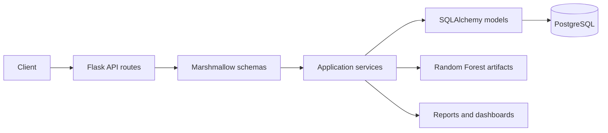

# CognIA

Backend API for an ML-powered screening platform for children aged 6–11.

> CognIA supports simulated screening and professional review. It is not a diagnostic system or a substitute for clinical assessment.

## Overview

CognIA brings questionnaire workflows, identity and access management, model inference, and reporting behind a versioned REST API. The backend is organized into routes, request schemas, services, persistence models, and migration-managed PostgreSQL storage. It is built as a production-oriented engineering project, with an OpenAPI contract, automated tests, container builds, and a GitHub Actions CI workflow.

## Key Features

- REST endpoints for authentication, questionnaires, screening workflows, and reports
- JWT authentication, multi-factor authentication, and role-based authorization
- Random Forest model inference integrated into questionnaire workflows
- PostgreSQL persistence with SQLAlchemy and Alembic migrations
- Marshmallow request validation and standardized API errors
- OpenAPI 3.0 contract with a local Swagger UI
- Docker image and Docker Compose configuration
- Pytest, Ruff checks, and GitHub Actions continuous integration

## Architecture


```mermaid
flowchart LR
    Client --> Routes[Flask API routes]
    Routes --> Schemas[Marshmallow schemas]
    Schemas --> Services[Application services]
    Services --> Models[SQLAlchemy models]
    Models --> DB[(PostgreSQL)]
    Services --> ML[Random Forest artifacts]
    Services --> Reports[Reports and dashboards]
```

The API layer validates requests and delegates application behavior to services. Services coordinate persistence and inference; Alembic manages schema changes, while OpenAPI documents the HTTP contract.

## Tech Stack

- **Backend:** Python 3.12, Flask 3
- **Data and persistence:** PostgreSQL, Flask-SQLAlchemy, SQLAlchemy, Alembic, Marshmallow
- **Machine learning:** scikit-learn, pandas, NumPy, joblib
- **Security:** Flask-JWT-Extended, PyOTP, bcrypt, cryptography, Flask-Limiter
- **Testing and quality:** pytest, coverage, Ruff
- **Delivery:** Docker, Docker Compose, Gunicorn, GitHub Actions

## Project Structure

```text
api/                 Flask routes, schemas, and services
app/                 SQLAlchemy models
config/              Application settings
migrations/          Alembic database migrations
docs/openapi.yaml    Current API contract
tests/               API, service, contract, and smoke tests
docker/              Container entrypoint and runtime files
```

## Demo

A public interactive demo is not currently verified. The repository documents a self-hosted deployment workflow, but it requires a separately provisioned host and runner. For a reproducible local run, follow the setup below and use synthetic data only.

- **API documentation:** [OpenAPI contract](docs/openapi.yaml); local Swagger UI is served at `/docs` when enabled by the application configuration.
- **Deployment guide:** [Self-hosted deployment](docs/deployment_ubuntu_self_hosted.md).

## Getting Started

### Prerequisites

- Python 3.12
- PostgreSQL, or Docker with Docker Compose
- Git

### Installation and configuration

```bash
git clone https://github.com/EndDark16/CognIA.git
cd CognIA
python -m venv .venv
```

Activate the environment, then install dependencies and create a local environment file:

```bash
# macOS / Linux
source .venv/bin/activate
cp .env.example .env
pip install -r requirements.txt
```

```powershell
# Windows PowerShell
.venv\Scripts\Activate.ps1
Copy-Item .env.example .env
pip install -r requirements.txt
```

Configure the database connection and generate unique local values for `SECRET_KEY` and `MFA_ENCRYPTION_KEY` in `.env`. Never commit real credentials. With the database available, initialize the schema and run the API:

```bash
alembic upgrade head
python run.py
```

The service listens on port `5000` by default. Check process health with `GET /healthz` and database readiness with `GET /readyz`. For questionnaire runtime data and model artifacts, use the documented bootstrap workflow in the [maintainer reference](docs/maintainer_reference_es.md).

## API

The canonical OpenAPI contract is [`docs/openapi.yaml`](docs/openapi.yaml). Useful local endpoints include:

| Method | Path | Purpose |
|---|---|---|
| `GET` | `/healthz` | Process liveness check |
| `GET` | `/readyz` | Database readiness check |
| `GET` | `/docs` | Swagger UI, when enabled |

The full endpoint inventory and versioning notes are in the maintainer reference.

## Machine Learning

The API integrates Random Forest inference with questionnaire workflows. Model artifacts are loaded by the runtime pipeline; inference is kept behind application services rather than exposed as an unqualified clinical prediction. The repository's methodology is screening support in a simulated environment, not diagnosis.

## Testing

The CI workflow installs Python 3.12, runs Ruff checks and compile/import sanity checks, executes the test suite, and builds the backend Docker image. Run the test suite locally with:

```bash
pytest -q
```

## CI/CD

GitHub Actions runs backend CI for pushes and pull requests targeting `development` and `main`. A separate best-effort deployment workflow targets a self-hosted Linux runner; deployment is not guaranteed by the CI workflow and requires infrastructure outside this repository.

## Security

The application includes JWT authentication, MFA support, role-based authorization, password hashing, request rate limiting, and environment-based configuration. Configure secrets outside source control and use non-production, synthetic data for evaluation. Security features do not make the screening output a clinical decision.

## Engineering Decisions

- **Layered application design:** route handlers, schemas, services, and persistence have separate responsibilities, which keeps HTTP concerns distinct from domain behavior.
- **Versioned data and API contracts:** Alembic migrations and a checked-in OpenAPI contract make database and API changes reviewable.
- **Best-effort deployment:** CI remains independent of the self-hosted deployment runner, so runner availability does not block the test and build checks.

## Future Improvements

- Publish a verified demo environment with synthetic data and restricted access.
- Add a concise architecture and workflow screenshot set.
- Continue consolidating legacy and current questionnaire API versions.

## Disclaimer

CognIA is an educational and engineering project for simulated screening workflows. It is not a medical device and must not be used to make clinical diagnosis or treatment decisions.

## Maintainer Reference

The existing detailed operational guide is preserved in [maintainer_reference_es.md](docs/maintainer_reference_es.md). It contains historical implementation details, deployment notes, configuration tables, and endpoint inventories.
